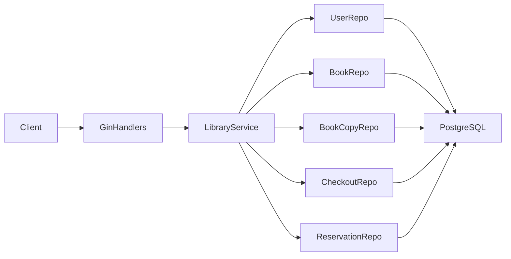
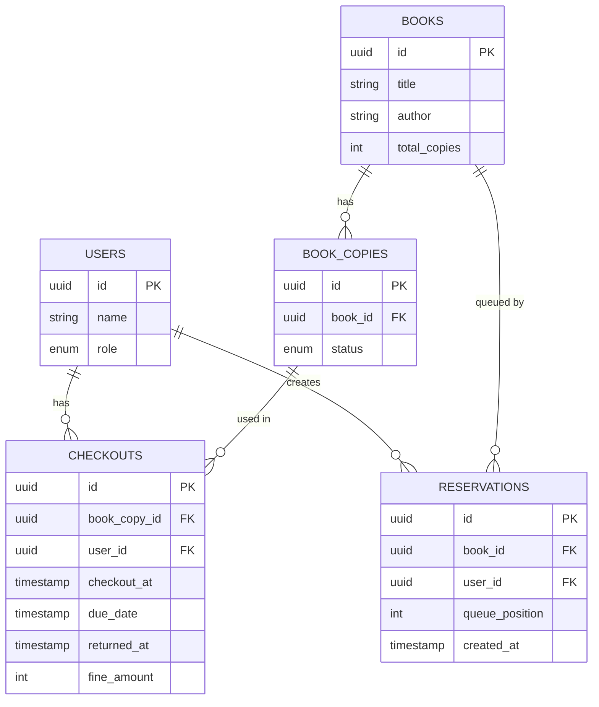
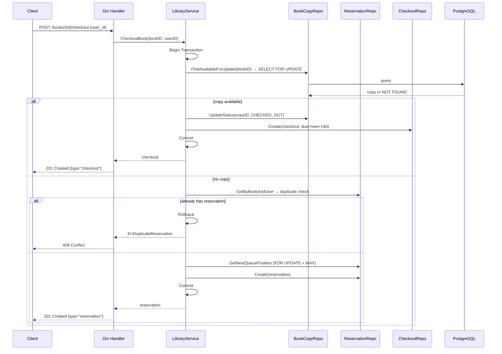

# DESIGN.md — Library Book Management API

This document provides an in-depth description of the architectural decisions, concurrency model, database constraints, trade-offs, and future considerations for the Library Book Management API.

---

## Table of Contents

1. [Architecture Diagram](#1-architecture-diagram)
2. [ER Diagram](#2-er-diagram)
3. [Checkout Flow (Sequence Diagram)](#3-checkout-flow-sequence-diagram)
4. [Workflow Invariants](#4-workflow-invariants)
5. [Concurrency Handling Strategy](#5-concurrency-handling-strategy)
6. [Transaction Isolation Assumptions](#6-transaction-isolation-assumptions)
7. [Database-Level Constraints](#7-database-level-constraints)
8. [Trade-offs Discussion](#8-trade-offs-discussion)
9. [Scalability Considerations](#9-scalability-considerations)
10. [Clean Architecture Considerations](#10-clean-architecture-considerations)
11. [Future Improvements](#11-future-improvements)

---

## 1. Architecture Diagram

High-level component view:



- **GinHandlers (`internal/handlers`)**: HTTP layer responsible for routing, request/response mapping, validation, and status codes. Translates domain errors to structured HTTP responses.
- **LibraryService (`internal/services`)**: Core business logic including transactions, reservation queueing, fine calculation, and structured logging.
- **Repositories (`internal/repositories`)**: Data access layer implemented using GORM; expose Go interfaces to the service layer.
- **Models (`internal/models`)**: Domain entities and enums, independent of HTTP and persistence.

---

## 2. ER Diagram

Simplified entity-relationship model:



Key constraints:

- `BOOK_COPIES.status` ∈ {`AVAILABLE`, `CHECKED_OUT`}.
- A `CHECKOUT` is active while `returned_at IS NULL`.
- A `Reservation` queue is per `book_id`, ordered by `queue_position`.

---

## 3. Checkout Flow (Sequence Diagram)



---

## 4. Workflow Invariants

These invariants must hold at all times and are enforced at **both** the application and database level:

| # | Invariant | Enforcement |
|---|---|---|
| I-1 | At most **one active checkout** exists per `BookCopy`. | `uniq_active_checkout` partial index + `SELECT FOR UPDATE` |
| I-2 | A `BookCopy` status is `CHECKED_OUT` if and only if an active checkout references it. | Transactional status update inside checkout/return flow |
| I-3 | A user has **at most one reservation** per book. | `uniq_user_book_reservation` unique index + application pre-check |
| I-4 | Each reservation has a **unique queue position** per book. | `uniq_book_queue_position` unique index + retry logic |
| I-5 | A reservation is **consumed exactly once** when a copy is returned. | Atomic delete-reservation + create-checkout in return transaction |
| I-6 | Fine is **non-negative** and calculated based on full calendar days. | Pure function `calculateFine`; minimum 1-day floor enforced |

---

## 5. Concurrency Handling Strategy

### Goals

- Ensure that **only one active checkout** exists per `BookCopy`.
- Prevent race conditions when multiple concurrent users attempt to:
  - Check out the same book simultaneously.
  - Return a copy while others are waiting in the reservation queue.

### Techniques Used

#### 1. Database Transactions (`db.Transaction` in GORM)

All critical flows (checkout, return) are wrapped in a single atomic transaction. Any failure at any point triggers a full rollback, preventing partial state.

#### 2. Row-Level Locks (`SELECT … FOR UPDATE`)

- **Checkout**: `FindAvailableForUpdate` queries `book_copies WHERE status = 'AVAILABLE' AND book_id = ?` with `FOR UPDATE`. This exclusively locks the matching rows — concurrent transactions attempting to read the same rows with `FOR UPDATE` will **wait**, not skip. Only one transaction gets the copy.

- **Return**: `GetByIDForUpdate` locks the `checkouts` row to prevent concurrent double-returns.

#### 3. Queue Position Computation Inside Transaction

When no copy is available, the reservation queue position is calculated **within the same transaction**:

```sql
SELECT COALESCE(MAX(queue_position), 0) + 1
FROM reservations
WHERE book_id = ?
-- After locking existing rows with FOR UPDATE
```

This ensures two concurrent reservations cannot assign the same position. If a collision still occurs (race between `MAX()` and `INSERT`), the `uniq_book_queue_position` index rejects one, and the application retries once.

#### 4. Atomic Return + Reassignment

The return flow and reassignment to the next reservation share the **same transaction**:

1. Mark checkout as returned (compute fine).
2. Mark `BookCopy` as `AVAILABLE`.
3. Fetch earliest reservation for that book.
4. If found: mark `BookCopy` as `CHECKED_OUT` again → delete reservation → create new checkout.

From the outside, this entire process appears as a **single, consistent state change**.

#### Why This Is Safe

- **No double checkouts**: `FOR UPDATE` lock serialises access to available copies.
- **FIFO Reservations**: `queue_position` uniqueness + `ORDER BY queue_position ASC` guarantees stable ordering.
- **Idempotent Returns**: The service checks `returned_at IS NOT NULL` and fails fast to prevent re-processing.
- **DB Backstop**: Even in the unlikely event of an application bug bypassing application-level guards, the `uniq_active_checkout` partial index prevents the database from ever recording two active checkouts for the same copy.

---

## 6. Transaction Isolation Assumptions

The system operates at PostgreSQL's default isolation level: **`READ COMMITTED`**.

Under `READ COMMITTED`:

- Each statement inside a transaction sees only rows committed **before** that statement began.
- `SELECT … FOR UPDATE` upgrades the lock to exclude other writers until the transaction commits.

**Why `READ COMMITTED` is sufficient here:**

- The `SELECT … FOR UPDATE` on `BookCopy` rows serialises all concurrent checkout attempts at the row level, providing the same safety as a higher isolation level for this specific access pattern.
- There is no multi-statement read-modify-write loop that could exhibit phantom reads under `READ COMMITTED` — each query operates on a single row by ID.

**If `REPEATABLE READ` or `SERIALIZABLE` were used:**

- They would add overhead for all transactions, including read-only ones.
- Serialisation failures would be more frequent and require application-level retry logic.

The chosen approach (explicit locking + `READ COMMITTED`) gives the strongest practical guarantee with the lowest overhead.

---

## 7. Database-Level Constraints

Database constraints serve as the final backstop when application logic has a bug or is bypassed.

| Constraint | Type | Enforces |
|---|---|---|
| `uniq_active_checkout` | Partial unique index | One active checkout per copy |
| `uniq_user_book_reservation` | Unique index | One reservation per user per book |
| `uniq_book_queue_position` | Unique index | No two reservations share a queue slot |
| `checkouts.book_copy_id → book_copies(id) ON DELETE RESTRICT` | FK + RESTRICT | Cannot delete a copy with active checkouts |
| `book_copies.book_id → books(id) ON DELETE CASCADE` | FK + CASCADE | Removing a book removes all its copies |
| `reservations.book_id → books(id) ON DELETE CASCADE` | FK + CASCADE | Removing a book clears its reservation queue |
| `checkouts.user_id → users(id) ON DELETE RESTRICT` | FK + RESTRICT | Cannot delete users with checkout history |

All indexes are created with `IF NOT EXISTS` to make the migration script **idempotent** (safe to re-run).

---

## 8. Trade-offs Discussion

### Optimistic vs. Pessimistic Locking

| | Pessimistic (`FOR UPDATE`) | Optimistic (version column) |
|---|---|---|
| **Used here** | ✅ | ✗ |
| **Contention** | Blocks concurrent writers | No blocking; retries on conflict |
| **Complexity** | Simple application code | Requires retry loops everywhere |
| **Best for** | High-write, high-conflict | Low-conflict, high-read |

For a library checkout system, **contention on a single popular book** is the expected hot path. Pessimistic locking is simpler and more correct for this case.

### In-Application vs. DB-Only Enforcement

We use **both** layers:

- Application layer provides early returns with meaningful error messages (e.g. `ErrDuplicateReservation` → 409) before even opening a transaction.
- Database constraints guarantee correctness even if application code is bypassed (e.g. direct DB writes).

### Denormalised `total_copies`

`books.total_copies` is a denormalised count, updated atomically via `IncrementTotalCopies`. The alternative — computing `COUNT(book_copies)` on every read — would add a JOIN to every book list query. A `CHECK` constraint could theoretically enforce consistency, but the transactional update is sufficient given the controlled write paths.

---

## 9. Scalability Considerations

| Concern | Current Approach | At Scale |
|---|---|---|
| **High checkout throughput** | `FOR UPDATE` row-lock serialises per copy | Works well per-copy; popular single-copy books become a bottleneck |
| **Connection pool** | `SetMaxOpenConns(20)` | Tune based on hardware; consider PgBouncer for connection pooling |
| **Read-heavy list endpoints** | Direct DB queries | Add caching (Redis) for `GET /books` |
| **Reservation queue contention** | `MAX() + FOR UPDATE` | At very high concurrency, consider a dedicated sequencer or use `SKIP LOCKED` |
| **Horizontal scaling** | Stateless HTTP service; all state in DB | Can run multiple instances behind a load balancer |
| **DB write bottleneck** | Single PostgreSQL instance | Read replicas for list queries; primary for writes |

The current design is **vertically scalable** (tune connection pool and PostgreSQL config) and **horizontally scalable** at the HTTP layer. The primary bottleneck at scale would be the PostgreSQL primary for write-heavy workloads.

---

## 10. Clean Architecture Considerations

- The **service layer** is the only place that knows about transactional semantics and workflow rules (e.g., "if no copy, create reservation").
- The **repositories** provide granular operations but do not orchestrate workflows.
- The **handlers** are intentionally thin — they perform request validation, call one service method, and map the result to an HTTP response.

This separation:

- Simplifies reasoning about concurrency and transactional behaviour (everything is in the service).
- Makes it easy to replace GORM or Gin with different technologies without touching business logic.
- Enables unit testing of service logic by mocking repositories.

---

## 11. Future Improvements

| Area | Description |
|---|---|
| `SKIP LOCKED` for queue | Use `SELECT FOR UPDATE SKIP LOCKED` if multiple workers process reservation queues concurrently |
| Idempotency keys | Accept a client-supplied `X-Idempotency-Key` header on checkout/return to deduplicate retried requests |
| Event sourcing | Emit domain events (BookCheckedOut, BookReturned, ReservationCreated) to enable audit trails and async notifications |
| Advisory locks | Use PostgreSQL advisory locks keyed by `book_id` as an alternative to row-level locks for extremely hot books |
| Outbox pattern | Write notifications (e.g. email) to an outbox table inside the same transaction to guarantee exactly-once delivery |
| Read/write split | Route `GET` endpoints to a PostgreSQL read replica; write endpoints to the primary |
| Metrics | Expose Prometheus metrics for checkout latency, reservation queue depth, and fine amounts |
