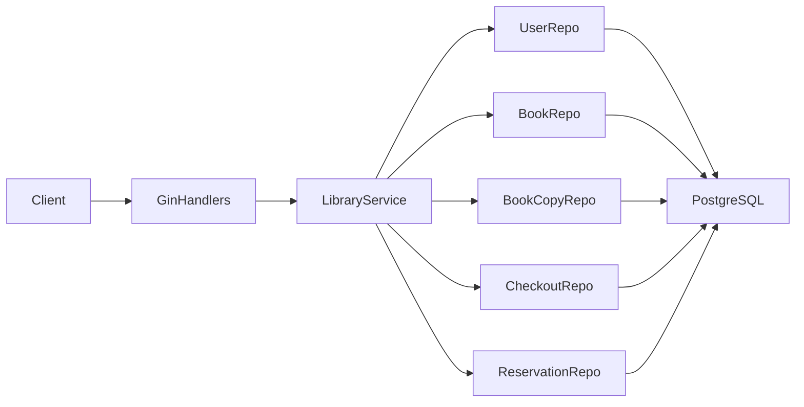
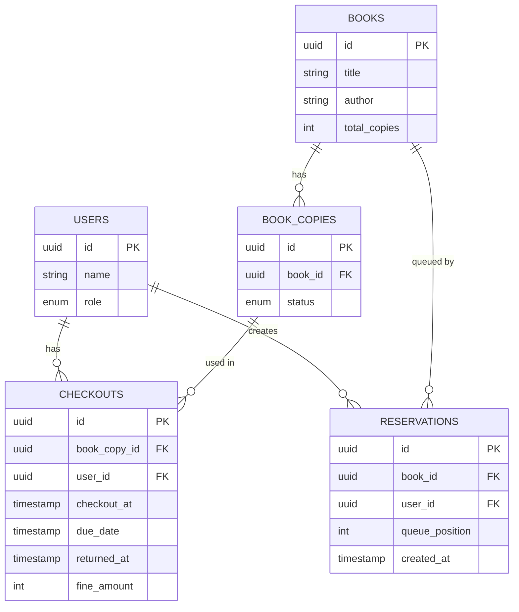
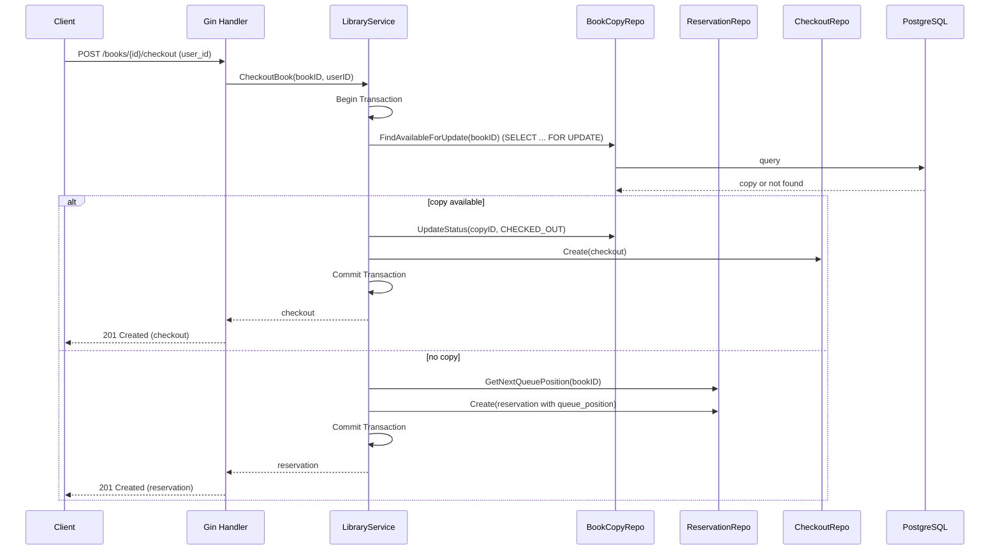

## Design Overview

This document describes the architecture, data model, and concurrency handling strategy for the Library Book Management API.

---

## Architecture Diagram

High-level component view:

- **GinHandlers (`internal/handlers`)**: HTTP layer responsible for routing, request/response mapping, and status codes.
- **LibraryService (`internal/services`)**: Core business logic including transactions, reservation queueing, and fine calculation.
- **Repositories (`internal/repositories`)**: Data access layer implemented using GORM; expose interfaces to the service layer.
- **Models (`internal/models`)**: Domain entities and enums, independent of HTTP and persistence.

---

## ER Diagram

Simplified entity-relationship model:

Key constraints:

- `BOOK_COPIES.status` ∈ {`AVAILABLE`, `CHECKED_OUT`}.
- A `CHECKOUT` is active while `returned_at IS NULL`.
- A `Reservation` queue is per `book_id`, ordered by `queue_position`.

---

## Checkout Flow (Sequence Diagram)

---

## Concurrency Handling Strategy

### Goals

- Ensure that **only one active checkout** exists per `BookCopy`.
- Prevent race conditions when multiple concurrent users attempt to:
  - Checkout the same book at the same time.
  - Return a copy while others are waiting in the reservation queue.

### Techniques Used

1. **Database Transactions** (`db.Transaction` in GORM):
   - Wrap checkout and return flows in a single atomic transaction.
   - Any failure in the middle of a workflow rolls back the whole operation.

2. **Row-Level Locks** (`SELECT ... FOR UPDATE` via GORM `clause.Locking`):
   - When checking out a book:
     - The service queries `book_copies` for an `AVAILABLE` copy with a `FOR UPDATE` clause.
     - This ensures that once a copy is chosen in one transaction, other concurrent transactions must wait until the first commits or rolls back.

3. **Queue Position Computation Inside Transactions**:
   - When no copy is available, the reservation queue position is calculated **within the same transaction**:
     - `queue_position = COALESCE(MAX(queue_position), 0) + 1` for the specified `book_id`.
   - This ensures that two concurrent reservations cannot assign the same `queue_position`.

4. **Locked Checkout on Return**:
   - When returning, the `Checkout` row is fetched with `FOR UPDATE`.
   - This prevents two concurrent return requests from double-processing the same checkout.

5. **Atomic Return + Reassignment**:
   - The return logic and reassignment to the next reservation share the same transaction:
     - Mark existing checkout as returned (and compute fine).
     - Mark `BookCopy` as `AVAILABLE`.
     - Fetch earliest reservation for that book.
     - If found, immediately:
       - Mark `BookCopy` as `CHECKED_OUT` again.
       - Delete reservation.
       - Create a new checkout for the reserved user.
   - From the outside, this entire process appears as a single, consistent state change.

### Why This Is Safe

- **No double checkouts**: Because we lock `BookCopy` rows on selection, two concurrent transactions cannot see the same copy as `AVAILABLE`.
- **FIFO Reservations**: `queue_position` and `created_at` combined ensure the queue is ordered and stable; calculating `queue_position` inside the transaction guarantees uniqueness.
- **Idempotent Returns**: The service checks whether a checkout is already returned and fails fast to prevent re-processing.

---

## Clean Architecture Considerations

- The **service layer** is the only place that knows about transactional semantics and workflow rules (e.g., "if no copy, create reservation").
- The **repositories** provide granular operations, but they do not orchestrate workflows.
- The **handlers** are thin and do not implement business rules.

This separation:

- Simplifies reasoning about concurrency and transactional behavior (everything is in the service).
- Makes it easy to replace GORM or Gin with different technologies without touching business logic.

